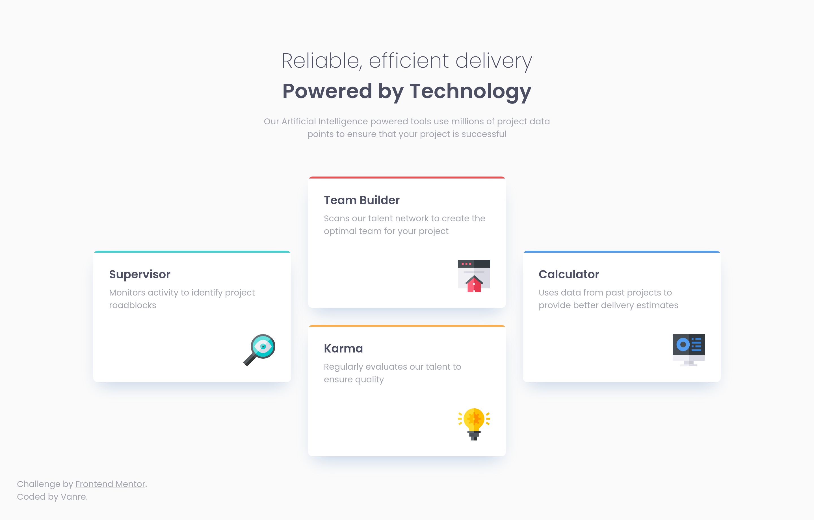

# Frontend Mentor - NFT preview card component solution

This is a solution to the . Frontend Mentor challenges help you improve your coding skills by building realistic projects. 


## Overview

### The challenge

Users should be able to:

- View the optimal layout depending on their device's screen size
- See hover states for interactive elements

### Solution Screenshot




### Links

- Live Site URL: [Add live site URL here](https://justinvanre.github.io/four-card-feature-section/)

## My process

### Built with

- HTML/CSS
- CSS variables


### Self reflection 

In this challenge, I struggled to make the middle two cards appear the same as in the solution, right in the middle, and a gap of 2em. I found out eventually that I was using a width of 100% - (some padding). To solve this, I set the middle two cards to be a width of 100% and gave the columns a max width of what the cards should be.  

```css
.karma, .team-builder {
  width: 100%;
}

.features {
  grid-template-columns: 1fr minmax(auto, 23.33333em) 1fr;
  align-items: center;
}

```

## Author

- Frontend Mentor - [@justinvanre](https://www.frontendmentor.io/profile/justinvanre)

